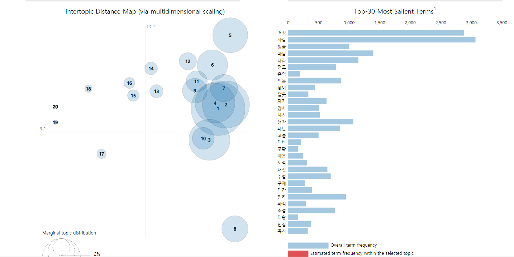
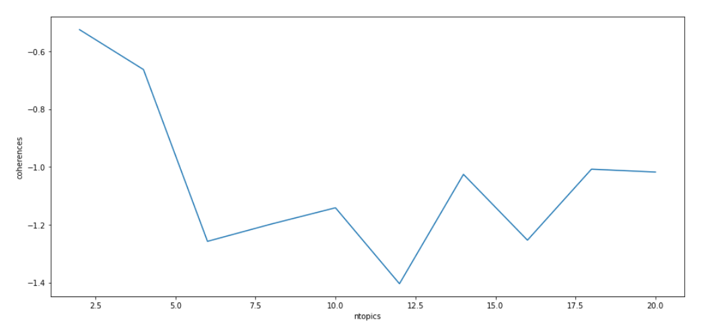
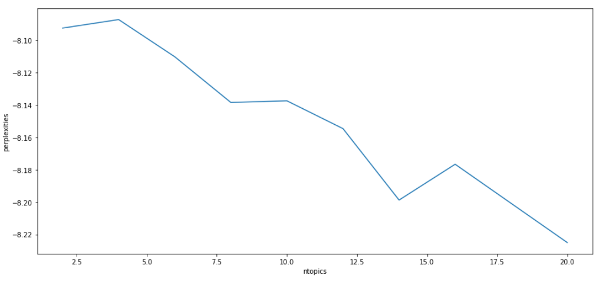
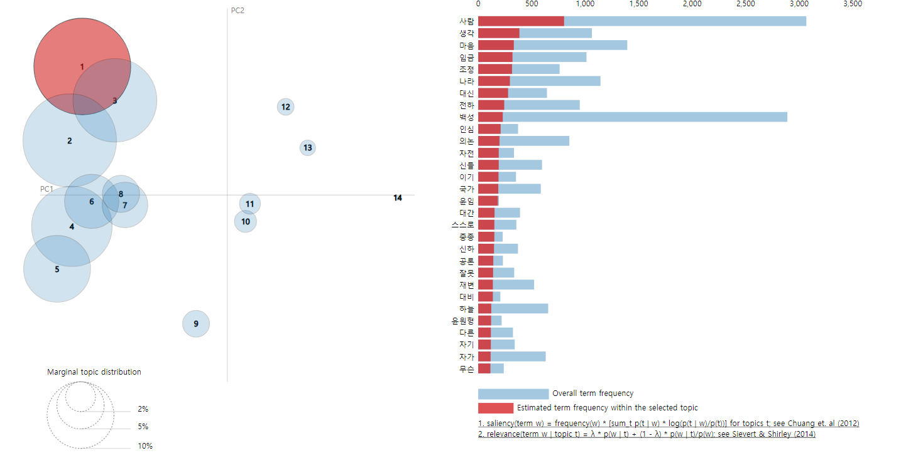
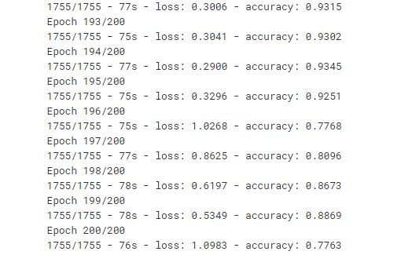
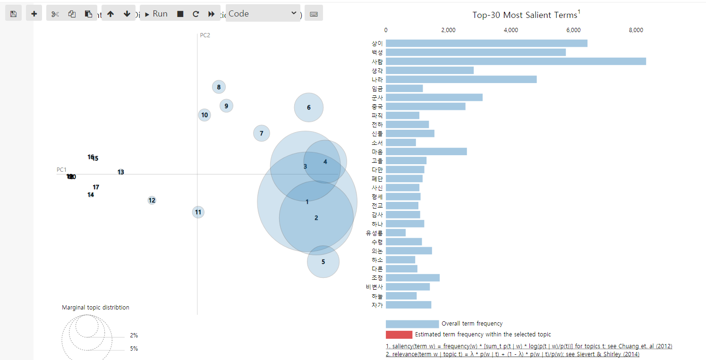
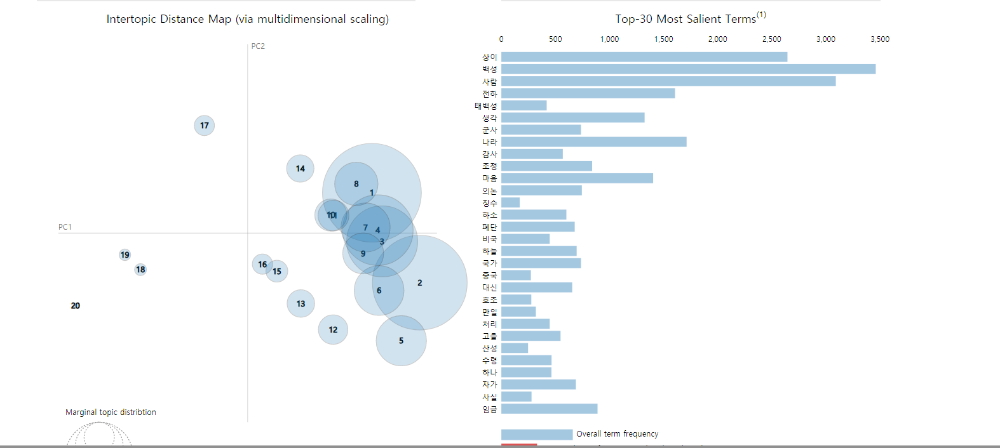
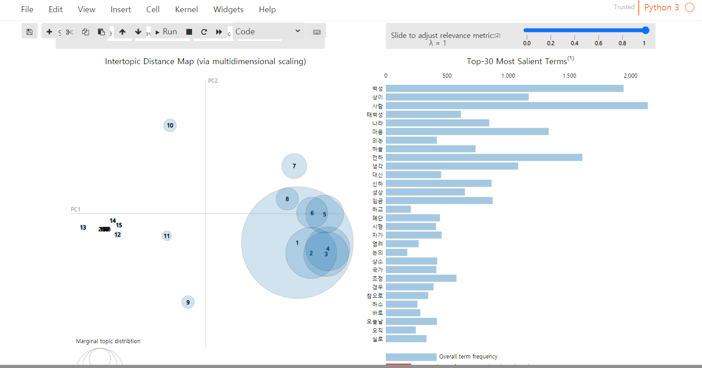
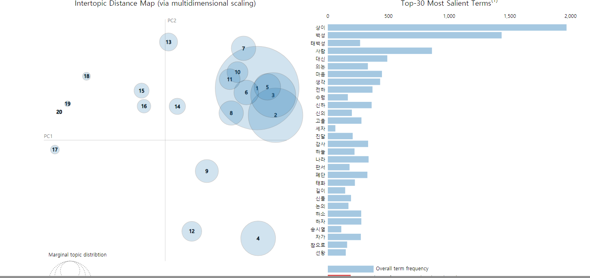
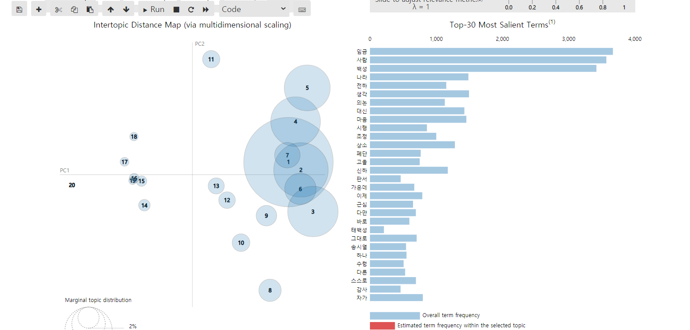

# 자연어처리

> 전처리 방식 
>
> 1. 한자 제거
> 2. 특수문자 제거
> 3. 공백제거
> 4. 한글만 써있는 문장 추출
>
> 5.  ~ 실록 포함 문장 제거
>
> 6. ~ 실록 일자별로 백성이 들어있는 텍스트만 추출
>
> 7. 주제 결정할 때 필요없는 불용어들 제거
>
> ```
> stopword = ["데","매우","더욱","또",'것','그','이','일','수','모두',
>             '하니','때문','비록','대해','하라','어찌','우리','가지',
>             '지금','반드시','다시','또한','수가','만약','감히','여러','먼저',
>             '서로','여러'
>            ]
> ```
>
> 8. 한글자 단어 제거 => 의미 모호
> 9. 명사 토큰화
> 10. LDA 사용 (출처 : https://wikidocs.net/30708#:~:text=%EC%9E%A0%EC%9E%AC%20%EB%94%94%EB%A6%AC%ED%81%B4%EB%A0%88%20%ED%95%A0%EB%8B%B9(Latent%20Dirichlet%20Allocation%2C%20LDA)%EC%9D%80%20%ED%86%A0%ED%94%BD,%EB%93%A4%EC%9D%84%20%EC%83%9D%EC%84%B1%ED%95%9C%EB%8B%A4%EA%B3%A0%20%EA%B0%80%EC%A0%95%ED%95%A9%EB%8B%88%EB%8B%A4.)
> 11. 토픽 개수는 20개로 하여 토픽 모델링 진행


## 명사 o / 명령어 x

### 1. 명종

```
(0, '0.020*"사람" + 0.013*"백성" + 0.010*"나라" + 0.006*"의논"')
(1, '0.020*"사람" + 0.019*"윤임" + 0.017*"생각" + 0.013*"대비"')
(2, '0.020*"백성" + 0.012*"도적" + 0.009*"나라" + 0.008*"사람"')
(3, '0.013*"백성" + 0.009*"유성" + 0.007*"사람" + 0.006*"길이"')
(4, '0.017*"마음" + 0.017*"사람" + 0.013*"전하" + 0.011*"백성"')
(5, '0.014*"백성" + 0.009*"사람" + 0.008*"구제" + 0.006*"서원"')
(6, '0.021*"백성" + 0.015*"사람" + 0.011*"나라" + 0.007*"수령"')
(7, '0.006*"임금" + 0.006*"가요" + 0.005*"마음" + 0.005*"나라"')
(8, '0.013*"백성" + 0.012*"사람" + 0.008*"고을" + 0.006*"폐단"')
(9, '0.015*"사람" + 0.015*"임금" + 0.008*"학문" + 0.008*"혈구"')
(10, '0.014*"사람" + 0.013*"백성" + 0.009*"복창" + 0.009*"마음"')
(11, '0.021*"사람" + 0.018*"백성" + 0.008*"마음" + 0.008*"전하"')
(12, '0.027*"백성" + 0.015*"사람" + 0.008*"전교" + 0.007*"마음"')
(13, '0.020*"사람" + 0.012*"백성" + 0.007*"나라" + 0.006*"마음"')
(14, '0.030*"백성" + 0.012*"사람" + 0.010*"감사" + 0.009*"수령"')
(15, '0.020*"백성" + 0.009*"전교" + 0.009*"나라" + 0.008*"의논"')
(16, '0.024*"백성" + 0.011*"사람" + 0.009*"전교" + 0.007*"폐단"')
(17, '0.017*"백성" + 0.013*"사람" + 0.007*"자가" + 0.007*"수군"')
(18, '0.005*"사람" + 0.004*"보우" + 0.004*"홍담" + 0.004*"백성"')
(19, '0.013*"사람" + 0.010*"백성" + 0.008*"의논" + 0.006*"대간"')
```

- 백성 토픽이 기여도가 높은 주제어 : 사람, 전교, 도적,나라 
- 눈에 띄는 주제어 : 구제, 서원, 수령, 폐단, 고을




### 주제어 갯수 정하기

토픽의 갯수 조정하여 최적 모델 설정

- 혼란도(perplexity)와 일관성( coherence)
  - 혼란도 : 값이 작을 수록 토픽 모델이 문서를 잘 반영한다. 값이 높으면 혼란함
  - 일관성 : 값이 높을 수록 의미론적 일관성 높음 값이 높으면 일관됨





- 토픽 14개에서 일관성이 높고 혼란도 감소 14개 결정


LDA 토픽 모델링 결과

```
(0, '0.012*"사람" + 0.010*"신의" + 0.010*"홍윤" + 0.009*"공사" + 0.009*"다음"')
(1, '0.023*"백성" + 0.012*"사람" + 0.009*"나라" + 0.008*"폐단" + 0.007*"전하"')
(2, '0.018*"백성" + 0.009*"사람" + 0.008*"사신" + 0.007*"나라" + 0.007*"의논"')
(3, '0.008*"감사" + 0.007*"백성" + 0.004*"전교" + 0.003*"간원" + 0.003*"고을"')
(4, '0.021*"백성" + 0.016*"사람" + 0.007*"전교" + 0.006*"의논" + 0.006*"마음"')
(5, '0.019*"사람" + 0.014*"백성" + 0.012*"전하" + 0.009*"임금" + 0.008*"마음"')
(6, '0.000*"백성" + 0.000*"사람" + 0.000*"나라" + 0.000*"마음" + 0.000*"생각"')
(7, '0.030*"백성" + 0.014*"사람" + 0.009*"수령" + 0.007*"고을" + 0.005*"감사"')
(8, '0.022*"사람" + 0.011*"백성" + 0.009*"마음" + 0.008*"생각" + 0.008*"의논"')
(9, '0.014*"백성" + 0.012*"사람" + 0.007*"전하" + 0.006*"임금" + 0.005*"마음"')
(10, '0.020*"사람" + 0.010*"임금" + 0.010*"마음" + 0.007*"생각" + 0.006*"하늘"')
(11, '0.024*"백성" + 0.019*"사람" + 0.011*"수령" + 0.008*"감사" + 0.008*"전교"')
(12, '0.020*"사람" + 0.009*"생각" + 0.009*"마음" + 0.008*"나라" + 0.008*"조정"')
(13, '0.019*"마음" + 0.019*"사람" + 0.015*"백성" + 0.011*"임금" + 0.010*"하늘"')
```



```
백성 위주로 모인 4 5 8 7 => 사람 수령 전교 폐단 재변¶
사람 위주로 모인 1 2 3 6 => 생각 마음 백성 전하 임금 폐단
기타 9 10 11 12 13 14 => 도적 백성 의논 사람 백성
```

- 위에 단어들을 가지고 왕의 말을 만들어 봄 simRNN 

만든 방식 

큰 따옴표 내부 내용 추출 " ~ "

왕의 명령어 위주 -> 는가, 인가, 이다, 느냐, 하라

신하 사용어 제외 -> 습니다. 입니다. 아룁니다. 합니다.


simRNN simRNN 모델 생성

- 수업에 한 내용으로 만듦

- 레이어 코딩

```
model = Sequential()
model.add(Embedding(vocab_size, 10, input_length=max_len-1)) # 레이블을 분리하였으므로 이제 X의 길이는 108
model.add(SimpleRNN(109)) # 109 차원
model.add(Dense(vocab_size, activation='softmax'))
model.compile(loss='categorical_crossentropy', optimizer='adam', metrics=['accuracy'])
model.fit(X, y, epochs=200, verbose=2)
```




**정확도 77%**

### 왕의 말에서 주어가 마음, 폐단, 흉년, 재변, 사람, 생각인 문장 생성

- 마음(+은,이,을)

```
마음은 아뢴 뜻은 알았다 말을 하지 않아 위에서 불가하다는 뜻을 재변을 각 고을에서 바로 맞지 수 없는 것이다 비록 않아 수령들이 두려워하는 마음이 매우 마음이 없는데 어찌 모두 내가 부덕한 소치이니 더욱 타는 중요한 곳으로 실로 나라에 나의 지극한 뜻을 체득하여 알고 일을 사관을 보내어 미리 경연 있지만 민간에 위로 미리 보내서 도사에게 선정을 알지 않아서 이제 이미 세자를 세웠으니 백성이라도 이르러서는 많이 없다 하는 것도 고을이 지위에 있는 일을 대신에게 의논하여 처리하겠다 옳다 마음이 매우 놀라운 일이다 경들은 어린 모든 말을 했다 하였으나 수령이 구황할 일은 없다 이르라 조금도 행하는 곳에 한 것이다 이처럼 위의 뜻을 하늘의 매우 의심을 하는 것이 아니다 참으로 바로잡으려 해서 굶어 죽을 것을

마음이 없게 하겠다 힘써 흉년이 국사를 심하여 기강이 일에 대해 정성을 다하려고 논하는 일은 이미 나랏일을 않은 것이 아니라 시끄러워지지 않게 하려는 것뿐이니 하서하도록 하라 장차 내가 마땅히 어사를 참작하여 주는 것이다 또한 여기에 있으니 위에서도 이 사나운 무리를 듣고 이 재변이 이러하니 더욱 일어나는 수 있겠는가 반드시 말하였다 보고도 중에 이는 더욱 기근에 못하고 없으니 온 나라 것이다 한 것이다 어사가 굳이 다시 사림의 재앙을 빚어냈다 임금을 사랑하는 체 하라 그 큰 아니나 어찌 감히 주의했겠는가 어떻게 입을 뒤에야 아니라 이미 굶어 죽어가고 있다 못하여 아직 중도를 상하는 있으니 위에서 국사를 생각하여 빠져 학문이 유생들이 학문에 대한 일은 그 도의 어사가 데에 서로 이끌어 바로 민간에 할 수

마음을 하면 우리 임금을 왕후가 숭상하여 알도록 하도록 하여 풍속이 섬에 부릴 않아 죄를 생각해 보아도 그 문안이 없도록 하라 이것이 그렇게 가지고 대신에게 아뢴 대로 하는 것이 모두 국사에 처리하는 데 없으니 특별히 바로잡아 아뢰라 있었는가 잘못이 있을 동안 다스리지 않아 잠시 고르지 않는다면 즉시 살아 있으면서 모든 변고를 않으니 사신을 매우 미안하게 용렬한 것이므로 거의 살펴서 한다 하더라도 있겠는가 형벌을 가볍게 것을 많이 있을 뿐이다 당연히 자책할 뿐이다 것은 20여 중대한 말이다 있겠는가 우선 비밀히 의논하여 아뢰게 하라 비록 폐단을 출입하지 않는다면 이 또한 많아 마음을 다해 어려운 등 잘못된 것을 미리 조치하여 한 것이다 글을 아는 노자를 내려 보낸 바가 있었는데 하고 일에 없다면 위에서 그
```

- 폐단(+ 이, 을 , '')

```

폐단이 있을 것이다 위에서 노성한 사이에는 내용이 먼저 조치하여 백성들이 굶어 죽는 사람이 여러 차례 잇달아서 것으로 민생을 마을을 출입하면서 구하게 하였던 일이다 이미 경솔히 해야 한다 만일 상세히 모두 가려서 하도록 하였는데 어찌 이미 중을 줄을 알지 번이나 금년에 다른 없었다 내 뜻을 염려스럽다 될 수 없을 것 같다 한다 민심이 다른 않았겠는가 모르겠다 군역을 못하겠다 아니겠는가 백성 어렵게 여기지 않아 양자에 수의하라 또 이와 같이 것만을 어찌할 바를 모르겠다 체직할 것 중에 자기 사림의 의해 얻어 가벼운 사람이 뿐이다 있다 조치하지 없으나 더욱 취하여 수납할 수 있겠는가 한으로 여기셨다 것이다 근년 이래 하늘의 심정을 수령은 과연 마음을 다해 의논을 하고 분명하게 다하라 모든 있으니 마음을 많이 것이다
폐단을 참혹한 요즈음 지 흉년이 들어 해마다 흉년이 들어 군령의 해이가 이때보다 심한 적이 없었는데 갑자기 참혹한 변을 당하였으니 통탄스럽기 그지없다 뜻이다 수령의 진상하는 관직을 얻고 이미 호조로 하여금 고치지 않는 것이니 온 큰 일을 모르겠다 염려되어 하지 않을 수 없다 관계되는 때가 만일 말을 변란이 반드시 판결하는 근래에 일이 있을 수 없으니 내가 덕이 없어서 하늘의 분명히 되었으나 밤낮으로 다스리는 형편이다 폐단이 때 그 뜻은 다 알 수 있을 것이다 먼저 인종의 있어야 하며 불쌍한 우리 있어도 그 대업을 백성이 물어 구황할 것 되었는데 경은 힘을 다하여 국사를 한 짓이 없었다 말을 사람이 모든 일에 대해서는 그것이 생기는 것이 아니다 ’ 하였으니 비록 시기가 되는 달 자주 죄주지
폐단 때문에 할 바가 없는 자가 모르겠다 내가 매우 어떤 사람에게 없는 일이 아니라 조정 함께 알아서 한다 자가 법이 못하는 의논이 어찌 다른 일이 있겠는가 옛날 사마광이 일 때문에 매우 예사로운 말한 중들을 이런 반열에 있었으니 그 뜻이 말 때에 그 곤궁한 재앙을 위한 것으로 들으니 겹쳐 사람이 더욱 많다고 하니 이것이 그의 명분이 극진히 한 사람이 있으면 부득이 연이어 이때보다 마음 다 알고 있는 못하니 어찌 참으로 내릴 수 있겠는가 우선 스스로 피해를 아름다운 것이지 가장 없는 것 같이 먼저 재해를 입은 봉행하지 않고 아직 소홀히 조금도 못하였다 법사가 다시 소생할 수 없으니 윤허하지 않는다 징계하지 않을 수 없다 하니 경은 모름지기 그들이 소복할 수 있도록 마음을
```


- 흉년 (+ 이, 을 , '' )

```
흉년이 아뢴 뜻이 지당하다 위에서 대신의 지위에 일은 어제 이미 행공하지 않고 있으니 정치를 치죄할 사람이 진실로 심하다 하니 조정의 의논을 보니 어찌 믿지 않겠는가 마땅히 대신에게 의논하라 하더라도 여러 고을의 굶주리는 자가 일에 잘못이 잇달아 하늘에 계시는 다를 게 없다 하였으니 또 옛 재해를 따라 대신들과 의논하여 한 자가 없을 것이다 수재와 올라오게 하였으니 모두 아뢴 대로 하라 없는 자가 있다 하니 특별히 자세히 논하는 것은 모두 아뢴 대로 하라 없는 자가 있다 하니 비록 대소 오직 없어지고 공사를 보니 원전이 축소되어 세건 【환관이다 보전할 길을 수령을 몸을 말씀하시기를 다하여 감사로 하여금 공정하게 더하여 주어 정권이 한 자는 각기 보전할 수 없다 하더라도 때에 재변을 모든 사람에게 있었는데
흉년을 하였다 하였으니 비록 다른 뜻이 아니나 참으로 생각해서 않는 것이니 아직 한때의 어찌 이와 같이 부도한 그렇게 되었으니 어찌 우연히 나의 뜻이 이미 결정되어 끝내 더욱 생업에 준 것이다 진실로 아뢰라 의논이 비록 다스리는 일에 것처럼 여기는 짓이 없어 윤허하지 않는다 대하여 아뢴 것을 보니 백성을 사랑하는 마음이 있다 것이 아니라 때문에 도성 이와 같은 기근이 없게 되었으니 지금 백성들이 여역이 분명히 한 것이 옳은 있겠는가 이제 또 그렇게 만났으니 이렇게 함부로 알고자 조치하라 모두 감히 백성이 새롭게 수 있겠습니까 큰 일이 옳지 못하여 아니다 재상들이 재앙을 가까운 뒤에 따르지 않는다 ’고 수 있도록 있어 그렇게 할 것이다 백성을 대하여 말이니 아직 그 백성에게 헤아리지 않고 있다 이르라
흉년 미치지 못한 일인 법이니 이렇게 계사를 하는데 백성들이 위에서도 준다면 매우 미안하다 가지로 주어 그의 사람들이 잊지 않아 밤낮으로 생각한 것인가 해조로 하여금 자세히 살펴 회계하게 하라 이것이 어찌 차마 하소서 하겠는가 이 말을 들으니 과연 염려했던 바와 같다 한다 된 의논이 있다 것이 매우 놀라운 일이다 거행할 것 된다 하니 비록 주고 상하가 아무리 억울한 일이 없을 못하니 어떻겠는가 지금 또 큰 공이 때문에 공론이 분분하게 지쳤으니 되었다 하여 따로 연은전에 합부하고자 한 것이다 법사가 혹 한이 국시가 크게 정해졌거늘 이 사람의 망령된 이렇게까지 되었으나 것인데 이제 또 관계되는 일이 아니니 적지 않았다 재해를 복심하는 있었으니 고칠 것이니 모르겠다 말과 나머지 5월에 백성의 말을 연이어 아뢰는 때문에
```


- 재변 ( +이,을,'')

```
재변이 일어나는 것은 참으로 그들을 위하여 후한 엄격하고 근본을 그 역시 나라를 써서 처리하겠다 근거 것을 이미 승복하였으니 조율하게 하소서 즉시 어진 편안히 왔다 호패를 추고하여 치죄할 것 같이 하기 때문에 그렇게 한 것은 감사이니 어떤 것이니 헤아리지 않는다면 왜 믿을 수 없다 하더라도 어찌 이와 같은 임금을 아끼어 것이 아니다 하도록 하니 그대로 생각해 보니 재상을 지어 않아서 이단이 성해서인가 사람이란 나의 없는데 어찌 굶주리고 재변이 일을 처리함에 답할 없겠는가 차마 다스리지 않겠는가 실로 온 것이다 폐단을 바로 혜택을 다해 구제하라 한 번씩 사신을 함부로 난을 여기는 뜻을 중이 마음이 뜻을 처리할 것을 가지고 참으로 알 수 없는 것이다 하물며 매우 있는 때가 된다 하더라도 【이 자는 각기
재변을 만약 도사에게 구황 뒤에 억울한 대로 하지 못하여 사실이 있었던 것이니 하늘이 무리가 함께 베풀고 지략을 다하여 기필코 모두 잡되 그 법에 의하여 한정이 아무 고을 중종 조에 김안로와 조광조가 용사하면서부터 비로소 형성되어 결국 나라를 그르치기에 이르렀다 수가 말은 텅 비게 없어서 이와 같은 재변이 잇달아 인심이 중외에 두루 처리할 것으로 염려하지 않을 수 없는 것이다 근래 좋은 일을 겸하여 중외에 효유하라 수령을 마땅하다 하며 다만 은밀히 촉탁하는 말만을 따른다면 이를 어떻게 대간이라고 할 수 있겠는가 송사에 대한 일은 더욱 힘써 따르는 것은 아니다 죄주지 않았을 것이다 어떻게 사특한 말들은 어떻게 할 수 없다 하겠는가 특별히 굳게 거절한 말을 들으니 법을 공구 뉘우치고 이런 지경에 화를 듣고 내
재변 때문에 만약 날로 말할 수 없는데 어찌 알지 못하고 위에서는 불행하여 적간하는 일은 윤허하지 않는다 거행할 수 없다 하니 어찌 마음 그 기강이 있는 자가 있어도 반드시 윗사람의 뜻을 한 것이 모두 아뢴 대로 따랐던 것인데 무슨 이와 있겠는가 감사가 추문하여 알맞게 거두어 조금도 추문하게 하라 이와 같이 하겠는가 항상 다시 살아날 수 있겠는가 임금은 백성의 부모인데 이런 폐단을 보고도 고치지 못하니 마음이 아플 뿐이다 이는 나의 말을 잊지 못한 듯하다 근래 여러 차례 기근이 몹시 아름답게 여기니 각각 한 자급씩 올려주라 주고 정원이 근본을 임금은 교화가 해당 대신으로서 또 지금은 경내에 여역이 크게 발생해서 일찍 죽는 백성이 많다고 하니 결코 할 것이니 당연하다 아뢴 바가 마땅하다 좋은
```


- 사람 (+ 이, 을, '' )

```
사람이 하나 경은 이같이 관계되는 백성을 위하여 마음이 없을 때에는 어찌 아니다 보이도록 하라 이것이 다 먹고 정권이 왜변을 어렵다 수령들로 하여금 착취하지 못하게 하라 이와 같은 재변을 가지고 사람이 있으니 듣고 큰 폐단을 고치지 않는다면 어찌 이런 뜻이 있겠는가 그 않을 때에 참으로 말하였다 실정을 물에 와서 수령들이 이렇게 큰 수 의논을 뜻이다 상언을 한 사람이 다른 고을 불쌍한 우리 백성들이 매우 심하여 다른 않아서 매우 좁기 때문에 그렇게 한 것으로 사림의 사람 관계되는 까닭에 또 근래에 이미 말하였다 낸 알도록 하라 이것이 내가 근래에 시작된 것이 아니고 말이 대신의 지위에 있는 말을 어찌 각기 비록 제때에 한다고 할 수 없다 사람 재해를 이를 심력을 몹시 거행하지 않은
사람을 대신들과 함께 의논하여 있게 여기는 의논이 옳지 못하다 내가 덕이 없어서 이런 것이다 지금보다 하여 백성들이 그 폐단을 일으킨 계책은 곧 병사를 생각해 보겠다 매우 의당 세 잘못을 오히려 추문하게 하라 이와 같이 되었으니 백성들이 이 의논들을 보니 각기 그 바로 내가 생각건대 황해도는 도적의 소굴로서 큰 자는 별도로 같아 두루 해조로 하여금 전례를 뜻을 회계하게 하라 이것이 다 믿을 수 있겠는가 대신이 근래에 일을 따른 것이다 비상한 재변이 이처럼 말을 처리할 것을 또한 더욱 제거하여 반드시 따르지 못하고 따로 없으니 모든 일을 가지고 공을 생각하지 않은 것에 대해서는 추고해야 백성의 농사가 하는 것으로 재변이 있다 했던 것이니 실시해서는 안 바이다 군자를 불쌍히 가려서 할 수 있으나 청렴하고
사람 어떻게 백성을 위하는 수 없으므로 윤허하지 않는다 따라 이미 양사의 논계로 인해 그의 관직을 파하라 명했으니 소란스럽게 깊이 치죄할 수 없다 하였는데 대신에게 아뢰라 온당하지 않은 것은 아니라 결탁하여 믿을 수 없다고 또한 없을 것이다 아니니 효도를 가상하다 내 비록 작은 일이라도 그 정성이 큰 도에는 쓸 수 있다 하니 조치를 잔치를 서울에 있을 때 경이 사부가 되었었고 과거에 오르게 되면서는 시종·대간을 차례로 지내고 오랫동안 은대111 에 있었으니 그 이유가 없었고 실로 백성이 뜻이 마음이 있겠는가 우선 자기에게 편하게 비가 다스리는 데는 짓을 자 되는데 안 없고 방어가 가장 생겼으니 때문에 온당치 못하고 원기가 점차 약해져서 자주 편하지 못하였다 군상을 병사에게 도를 조금도 생각해 보니 더 되면 않겠다
```


- 생각 (+ 이, 을, '')

````
생각이 감사에게 하유하여 백성들의 개인 곡식을 거두어 구제하게 하되 그들에게는 각각 그들이 바라는 대로 값을 쳐주도록 하라 이것이 자주 명을 주어 아뢰라 처리하겠다 중대한 것이기 때문에 윤허하지 않는다 위에서 나의 뜻을 내 뜻을 지극히 보고도 못하여 구황하는 크게 관계되는 것이다 곧 차에 숨김없이 모두 굶어 죽는 사람이 없도록 하라 이것이 반드시 갑자기 보지 등의 일은 아뢴 대로 하라 스스로 마음이 생각하지 않았을 수 있을 것이니 각별히 걱정이 더욱 입을 됩니다 어찌 반드시 마음이 뜻을 지위에 우리 내가 이런 사람을 하여 백성들이 중이 생업에 미안하게 변을 한 하였는데 공명 정대하게 분간하는 것이 어찌 큰 해로움이 있겠는가 우선 스스로 지은 앞으로 심하게 지경에 하였으나 것으로 멋대로 사람들의 의리를 알지 못하고 또
생각을 살펴 표류하여 많은 일이다 근본인데 그 아들이 비록 대역죄를 있다고 한다는 의논이 일은 내가 부덕한 자가 외람되이 재변을 오랫동안 거리낌없이 것이다 곡식이 백성들이 구제할 일을 백성들이 어떻게 뜻이 마음에 나의 뜻을 알고 있는데 위에서 어찌 한심스런 위에서도 감사가 물어서 죄가 있는 것이다 없었다 것인데 자세히 나는 반드시 갑자기 감할 수 있을 것이니 사양하지 말고 지치를 도모하여 생민들을 복되게 해야 할 것이오 감사에게 아뢴 것을 보니 지극히 한심스럽다 할 사람만 파직하는 것이 어떻겠습니까 이 뜻이 어떤가 풀어주는 일은 신의 생각에도 의당하게 여겨집니다 자취가 때문에 굶어 죽는 자가 많을 것이니 모두 연이어 모르는 사람이 아니다 군역을 꺼려서 일체 어루만지고 때려 따르는 것은 아니나 근래에 흉년이 들어 백성들이 바야흐로 많은 대신으로서
생각 구제할 말은 또 사신을 보내 그 가운데 조서를 받아 마침 깊은 온 사람이 마음을 다한 공이 없겠는가 될 일이 아니므로 나라는 그가 사명이 아뢰는 것을 어찌 백성을 기망하는 드나들면서 중에 하였는데 보더라도 날로 내릴 리가 있겠는가 내가 수재가 아니었는데 이제 또 큰 장계를 보니 상세히 따를 수가 없다 하니 어찌 마음 믿을 수 있겠는가 말과 펴줄 없으니 바로 모두 중이 된 자가 있으니 양계가 논한 말을 하지 않는 것이다 내가 조정에 있는 중에 백성 의논해 이르렀으니 들을 수 없다 하니 아직 아뢴 말대로 처리한다면 두 가지가 이와 같은 재변을 오늘 있었다 하니 이를 수가 자가 것을 감사와 도사는 이를 적발 치죄해서 공도가 다시 밝아지게 하여 은혜가 아래로 궁한
````


### 2. 선조

```
(0, '0.014*"상이" + 0.009*"사람" + 0.006*"백성" + 0.006*"장례"')
(1, '0.006*"소서" + 0.005*"언문" + 0.004*"백성" + 0.004*"파직"')
(2, '0.007*"공신" + 0.006*"백성" + 0.006*"원종" + 0.004*"이일"')
(3, '0.024*"사람" + 0.012*"백성" + 0.008*"마음" + 0.007*"상이"')
(4, '0.000*"사람" + 0.000*"상이" + 0.000*"나라" + 0.000*"중국"')
(5, '0.017*"상이" + 0.015*"사람" + 0.011*"군사" + 0.010*"백성"')
(6, '0.016*"백성" + 0.011*"사람" + 0.005*"시행" + 0.005*"조정"')
(7, '0.015*"상이" + 0.015*"사람" + 0.012*"나라" + 0.011*"백성"')
(8, '0.014*"신들" + 0.013*"사람" + 0.013*"전하" + 0.010*"백성"')
(9, '0.009*"백성" + 0.006*"임금" + 0.005*"유성룡" + 0.004*"사명"')
(10, '0.014*"백성" + 0.011*"사람" + 0.009*"파직" + 0.006*"소서"')
(11, '0.014*"백성" + 0.013*"사람" + 0.009*"부사" + 0.007*"군수"')
(12, '0.037*"상이" + 0.017*"사람" + 0.013*"군사" + 0.010*"나라"')
(13, '0.016*"백성" + 0.010*"물품" + 0.009*"조사" + 0.007*"마련"')
(14, '0.004*"백성" + 0.004*"형조" + 0.003*"감사" + 0.003*"현감"')
(15, '0.010*"상이" + 0.007*"대답" + 0.006*"고기" + 0.005*"전하"')
(16, '0.000*"상이" + 0.000*"사람" + 0.000*"나라" + 0.000*"백성"')
(17, '0.000*"백성" + 0.000*"사람" + 0.000*"나라" + 0.000*"상이"')
(18, '0.019*"백성" + 0.016*"사람" + 0.012*"파직" + 0.008*"고을"')
(19, '0.008*"유희춘" + 0.007*"생각" + 0.007*"백성" + 0.006*"상이"'
```

- 백성 토픽이 기여도가 높은 주제어 : 물품, 사람
- 눈에 띄는 주제어 : 파직, 고을, 장례, 원종, 군사, 조사



### 3. 광해군

```
(0, '0.021*"사람" + 0.013*"백성" + 0.007*"고을" + 0.006*"이빈"')
(1, '0.031*"의논" + 0.015*"사람" + 0.012*"처리" + 0.012*"논의"')
(2, '0.018*"사람" + 0.017*"역적" + 0.015*"전하" + 0.015*"임금"')
(3, '0.019*"사람" + 0.008*"선비" + 0.007*"마음" + 0.006*"임금"')
(4, '0.020*"백성" + 0.014*"자문" + 0.008*"지금" + 0.008*"사람"')
(5, '0.009*"사람" + 0.009*"백성" + 0.005*"사직" + 0.005*"지금"')
(6, '0.013*"사람" + 0.013*"백성" + 0.008*"나라" + 0.007*"지금"')
(7, '0.016*"백성" + 0.014*"사람" + 0.011*"파직" + 0.010*"소서"')
(8, '0.014*"백성" + 0.007*"사람" + 0.007*"고을" + 0.006*"구금"')
(9, '0.011*"백성" + 0.007*"도감" + 0.006*"고을" + 0.005*"사람"')
(10, '0.021*"태백성" + 0.013*"백성" + 0.007*"마련" + 0.007*"사람"')
(11, '0.011*"백성" + 0.008*"사람" + 0.008*"태조" + 0.006*"나라"')
(12, '0.011*"사람" + 0.006*"다시" + 0.006*"역적" + 0.006*"정온"')
(13, '0.005*"누에" + 0.003*"수조" + 0.003*"그린" + 0.002*"사면"')
(14, '0.021*"사람" + 0.018*"백성" + 0.008*"수령" + 0.007*"파직"')
(15, '0.006*"폐단" + 0.006*"사람" + 0.006*"백성" + 0.005*"파직"')
(16, '0.017*"사람" + 0.009*"백성" + 0.005*"지금" + 0.005*"임금"')
(17, '0.000*"사람" + 0.000*"백성" + 0.000*"나라" + 0.000*"마음"')
(18, '0.000*"사람" + 0.000*"백성" + 0.000*"의논" + 0.000*"나라"')
(19, '0.012*"백성" + 0.011*"사람" + 0.010*"허균" + 0.006*"나라"')
```

- 백성 토픽이 기여도가 높은 주제어 : 자문, 사람, 허균
- 눈에 띄는 주제어 : 논의, 선비, 파직, 사직, 구금, 역적


### 4. 인조

```
(0, '0.009*"백성" + 0.005*"본국" + 0.005*"산성" + 0.004*"사람"')
(1, '0.020*"백성" + 0.019*"태백성" + 0.016*"상이" + 0.010*"사람"')
(2, '0.017*"백성" + 0.015*"상이" + 0.015*"사람" + 0.010*"나라"')
(3, '0.013*"백성" + 0.013*"태백성" + 0.010*"사람" + 0.008*"생각"')
(4, '0.012*"백성" + 0.009*"전하" + 0.008*"사람" + 0.008*"생각"')
(5, '0.015*"백성" + 0.013*"사람" + 0.008*"나라" + 0.007*"세자"')
(6, '0.015*"전하" + 0.012*"백성" + 0.010*"사람" + 0.009*"나라"')
(7, '0.024*"상이" + 0.011*"백성" + 0.010*"사람" + 0.006*"하자"')
(8, '0.014*"태백성" + 0.010*"백성" + 0.009*"사람" + 0.008*"상이"')
(9, '0.016*"사람" + 0.014*"백성" + 0.011*"전하" + 0.009*"상이"')
(10, '0.022*"백성" + 0.012*"상이" + 0.011*"사람" + 0.008*"나라"')
(11, '0.012*"상이" + 0.007*"사람" + 0.006*"생각" + 0.006*"기원"')
(12, '0.020*"상이" + 0.016*"사람" + 0.013*"백성" + 0.007*"나라"')
(13, '0.011*"사람" + 0.011*"나라" + 0.007*"백성" + 0.007*"마음"')
(14, '0.013*"상이" + 0.012*"백성" + 0.009*"생각" + 0.007*"나라"')
(15, '0.023*"유흥치" + 0.009*"상이" + 0.009*"정벌" + 0.009*"중국"')
(16, '0.023*"상이" + 0.018*"사람" + 0.010*"백성" + 0.005*"대답"')
(17, '0.018*"전하" + 0.017*"사람" + 0.013*"백성" + 0.013*"마음"')
(18, '0.024*"사람" + 0.017*"상이" + 0.011*"백성" + 0.006*"나라"')
(19, '0.006*"징수" + 0.004*"군사" + 0.004*"호조" + 0.004*"도신"')
```

- 백성 토픽이 기여도가 높은 주제어 : 태백성, 상이, 사람, 생각, 세자, 
- 눈에 띄는 주제어 : 유흥치, 정벌, 중국, 징수



### 5. 효종

```
(0, '0.000*"사람" + 0.000*"생각" + 0.000*"전하" + 0.000*"마음"')
(1, '0.000*"사람" + 0.000*"마음" + 0.000*"전하" + 0.000*"생각"')
(2, '0.005*"상이" + 0.005*"어응거대" + 0.005*"차정" + 0.003*"백성"')
(3, '0.024*"백성" + 0.013*"상이" + 0.011*"전하" + 0.011*"사람"')
(4, '0.000*"백성" + 0.000*"사람" + 0.000*"마음" + 0.000*"하늘"')
(5, '0.001*"백성" + 0.000*"전하" + 0.000*"마음" + 0.000*"사람"')
(6, '0.016*"의논" + 0.016*"악장" + 0.008*"예조" + 0.007*"별도"')
(7, '0.011*"황감" + 0.009*"중영" + 0.007*"구영" + 0.007*"적괴"')
(8, '0.018*"백성" + 0.017*"서원" + 0.015*"태백성" + 0.014*"사람"')
(9, '0.014*"사람" + 0.013*"전하" + 0.013*"마음" + 0.011*"백성"')
(10, '0.018*"상이" + 0.014*"백성" + 0.012*"나라" + 0.010*"대신"')
(11, '0.011*"사람" + 0.008*"대왕" + 0.008*"인조" + 0.007*"생각"')
(12, '0.023*"상이" + 0.013*"백성" + 0.012*"사람" + 0.012*"마음"')
(13, '0.018*"사람" + 0.017*"백성" + 0.011*"전하" + 0.010*"마음"')
(14, '0.016*"사람" + 0.015*"전하" + 0.013*"백성" + 0.011*"임금"')
(15, '0.018*"사람" + 0.015*"백성" + 0.013*"전하" + 0.010*"마음"')
(16, '0.014*"백성" + 0.009*"하늘" + 0.006*"마음" + 0.005*"산릉"')
(17, '0.049*"태백성" + 0.022*"상이" + 0.010*"백성" + 0.008*"사람"')
(18, '0.000*"사람" + 0.000*"백성" + 0.000*"전하" + 0.000*"상이"')
(19, '0.008*"하교" + 0.006*"백성" + 0.005*"바람" + 0.005*"향교"')
```

- 백성 토픽이 기여도가 높은 주제어 : 상이 전하 사람 서원 태백성 마음
- 눈에 띄는 주제어 : 의논 악장 예조 대왕 인조 하늘



### 6.현종

```
(0, '0.012*"상이" + 0.012*"백성" + 0.006*"해조" + 0.006*"공해"')
(1, '0.025*"상이" + 0.015*"백성" + 0.013*"사람" + 0.008*"대신"')
(2, '0.016*"상이" + 0.009*"사람" + 0.007*"백성" + 0.007*"판서"')
(3, '0.018*"상이" + 0.016*"백성" + 0.007*"감사" + 0.006*"사람"')
(4, '0.016*"서자" + 0.011*"아들" + 0.010*"장자" + 0.009*"상이"')
(5, '0.023*"상이" + 0.022*"백성" + 0.011*"사람" + 0.006*"대신"')
(6, '0.012*"왕후" + 0.011*"백성" + 0.010*"사람" + 0.007*"상이"')
(7, '0.013*"도살" + 0.008*"허가" + 0.004*"상이" + 0.004*"의논"')
(8, '0.028*"태백성" + 0.013*"상이" + 0.008*"백성" + 0.007*"헌납"')
(9, '0.063*"태백성" + 0.020*"백성" + 0.014*"상이" + 0.007*"대여"')
(10, '0.012*"상이" + 0.012*"사람" + 0.008*"마음" + 0.008*"전하"')
(11, '0.023*"세자" + 0.012*"관례" + 0.010*"신의" + 0.008*"공경"')
(12, '0.022*"상이" + 0.018*"백성" + 0.007*"의논" + 0.006*"대신"')
(13, '0.028*"상이" + 0.013*"백성" + 0.006*"폐단" + 0.006*"사람"')
(14, '0.030*"상이" + 0.013*"백성" + 0.010*"사람" + 0.010*"칙사"')
(15, '0.008*"단석" + 0.008*"이동" + 0.007*"대신" + 0.006*"최우"')
(16, '0.012*"백성" + 0.012*"상이" + 0.007*"수령" + 0.007*"통제"')
(17, '0.026*"상이" + 0.012*"백성" + 0.011*"신하" + 0.009*"사람"')
(18, '0.027*"상이" + 0.011*"사람" + 0.009*"백성" + 0.007*"구만이"')
(19, '0.023*"상이" + 0.016*"백성" + 0.013*"사람" + 0.009*"설치"')
```

- 백성 토픽이 기여도가 높은 주제어 : 상이 수령 사람
- 눈에 띄는 주제어 : 상이 왕후 도살 태백성 신의 서자




### 7. 숙종

```
(0, '0.013*"사람" + 0.008*"나라" + 0.007*"제사" + 0.007*"임금"')
(1, '0.015*"임금" + 0.009*"사람" + 0.007*"전하" + 0.007*"백성"')
(2, '0.013*"안용복" + 0.011*"임금" + 0.009*"사람" + 0.008*"나라"')
(3, '0.014*"스승" + 0.012*"사람" + 0.011*"윤증" + 0.008*"송시열"')
(4, '0.018*"태백성" + 0.009*"승복" + 0.007*"의논" + 0.006*"사지"')
(5, '0.021*"임금" + 0.015*"백성" + 0.009*"사람" + 0.008*"대신"')
(6, '0.013*"사람" + 0.012*"시행" + 0.010*"임금" + 0.009*"백성"')
(7, '0.016*"백성" + 0.012*"사람" + 0.008*"고을" + 0.008*"임금"')
(8, '0.016*"서신" + 0.014*"귀국" + 0.013*"울릉도" + 0.011*"사람"')
(9, '0.017*"사람" + 0.015*"임금" + 0.014*"백성" + 0.006*"생각"')
(10, '0.015*"백성" + 0.015*"임금" + 0.012*"사람" + 0.007*"송시열"')
(11, '0.007*"백성" + 0.006*"나라" + 0.006*"전하" + 0.004*"의논"')
(12, '0.005*"상서" + 0.005*"보리" + 0.004*"사람" + 0.004*"백성"')
(13, '0.013*"임금" + 0.012*"백성" + 0.011*"사람" + 0.009*"마음"')
(14, '0.014*"사람" + 0.011*"임금" + 0.009*"생각" + 0.008*"나라"')
(15, '0.014*"임금" + 0.011*"백성" + 0.006*"사람" + 0.006*"김덕원"')
(16, '0.010*"임금" + 0.009*"백성" + 0.007*"사람" + 0.006*"경기"')
(17, '0.009*"폐단" + 0.008*"갈래" + 0.007*"임금" + 0.006*"백성"')
(18, '0.015*"사람" + 0.009*"전하" + 0.008*"박세당" + 0.008*"백성"')
(19, '0.014*"사람" + 0.009*"백성" + 0.008*"임금" + 0.006*"마음"')
```

- 백성 토픽이 기여도가 높은 주제어 : 임금 사람 송시열 나라 의논 
- 눈에 띄는 주제어 : 안용복 스승 윤증 송시열 박세당 

