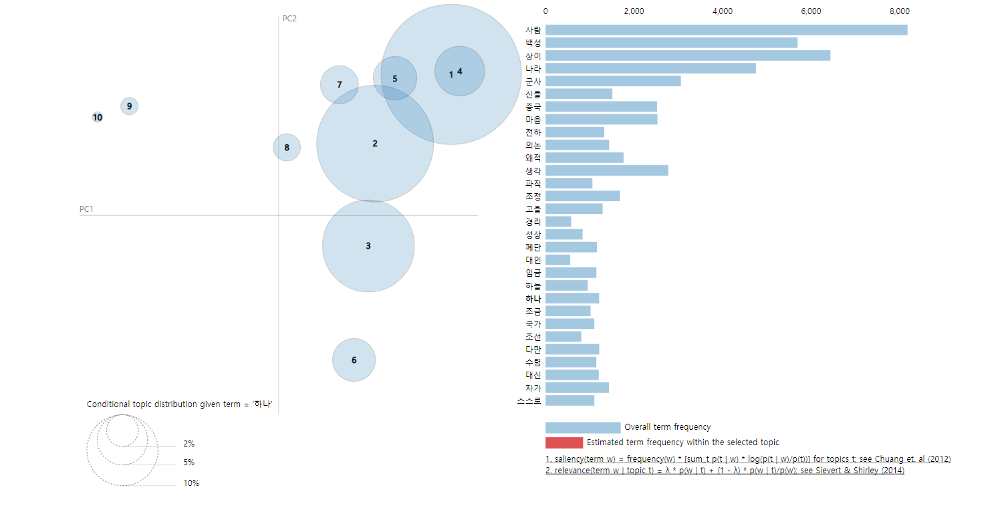
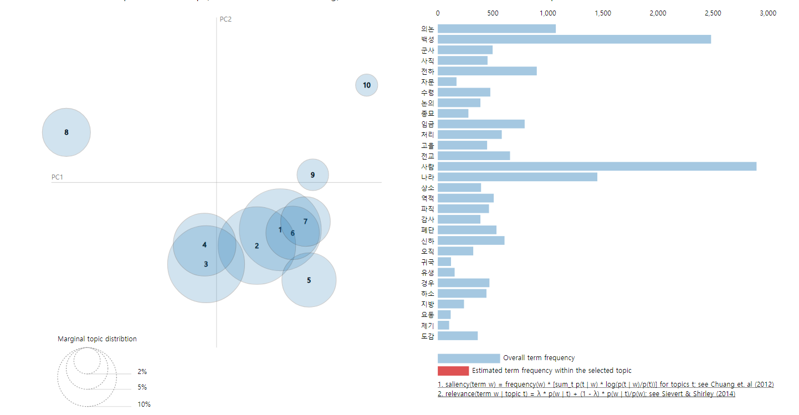
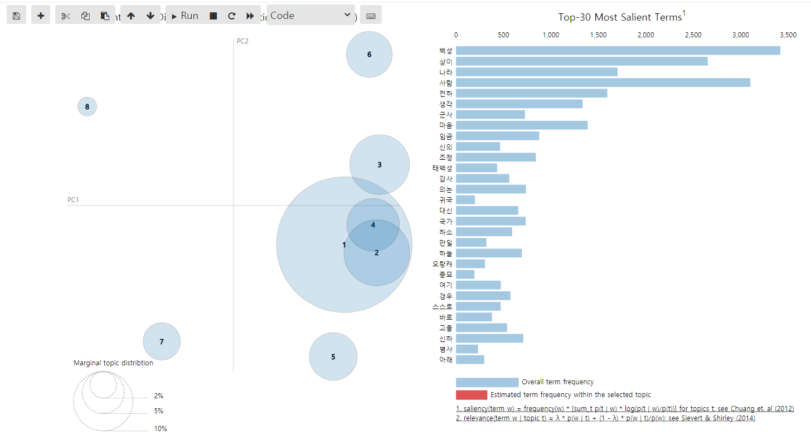
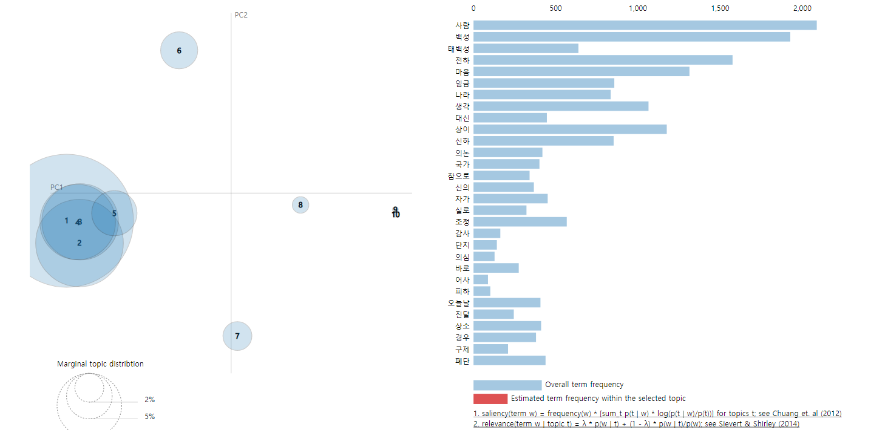

# 명종, 선조, 광해군, 인조, 효종, 현종, 숙종

1. ## 명종 (13대 - 23년)

```
(0, '0.014*"백성" + 0.008*"나라" + 0.008*"사람" + 0.007*"전교" + 0.006*"정유"')
(1, '0.009*"구제" + 0.007*"백성" + 0.006*"파직" + 0.004*"입안" + 0.004*"병사"')
(2, '0.023*"사람" + 0.011*"마음" + 0.010*"백성" + 0.009*"생각" + 0.008*"임금"')
(3, '0.010*"백성" + 0.006*"전교" + 0.006*"내수사" + 0.005*"노비" + 0.004*"병풍"')
(4, '0.023*"백성" + 0.013*"사람" + 0.010*"의논" + 0.010*"수령" + 0.009*"감사"')
(5, '0.021*"백성" + 0.015*"사람" + 0.007*"나라" + 0.006*"마음" + 0.006*"폐단"')
(6, '0.015*"백성" + 0.008*"마음" + 0.007*"전하" + 0.006*"유생" + 0.006*"사람"')
(7, '0.013*"백성" + 0.009*"사람" + 0.006*"격쟁" + 0.005*"자가" + 0.005*"상이"')
(8, '0.007*"백성" + 0.006*"윤옥" + 0.004*"고을" + 0.004*"안국" + 0.004*"동료"')
(9, '0.014*"사람" + 0.013*"전하" + 0.011*"임금" + 0.010*"백성" + 0.009*"나라"')
```


- 백성 2800 
- 평균 백성 단어수 = 총 백성 / 재위기간 = 2800 /23 = 121

- 폐단 - 수령 - 노비 = 백정 출신 임꺽정이 탐관오리 죽이는 일 발생

- 구제 - 파직 - 입안 - 윤원형 = 외척의 전횡, 을사사화


2. ## 선조(14대 - 42년)

```
(0, '0.019*"사람" + 0.015*"백성" + 0.007*"상이" + 0.007*"나라"')
(1, '0.020*"상이" + 0.014*"사람" + 0.012*"나라" + 0.011*"군사"')
(2, '0.008*"사람" + 0.004*"백성" + 0.004*"공신" + 0.003*"원종"')
(3, '0.016*"신들" + 0.013*"전하" + 0.011*"사람" + 0.011*"성상"')
(4, '0.014*"사람" + 0.013*"백성" + 0.011*"상이" + 0.009*"군사"')
(5, '0.021*"사람" + 0.011*"백성" + 0.008*"마음" + 0.008*"상이"')
(6, '0.011*"나라" + 0.010*"사람" + 0.010*"상이" + 0.010*"백성"')
(7, '0.014*"나라" + 0.013*"상이" + 0.013*"경리" + 0.012*"사람"')
(8, '0.013*"사람" + 0.009*"백성" + 0.005*"파직" + 0.004*"상이"')
(9, '0.011*"사람" + 0.010*"백성" + 0.007*"나라" + 0.007*"의논"')
```




- 백성 5800

- 평균 백성 단어수 = 총 백성 / 재위기간 = 5800 /42 = 138

- 왜적, 중국, 중국 - 임진왜란 발생 ->  백성이 많이 나오지 않았나...


3. ## 광해군(15대 - 16년)

```
(0, '0.030*"의논" + 0.016*"사람" + 0.014*"사직" + 0.014*"논의"')
(1, '0.015*"백성" + 0.010*"사람" + 0.010*"수령" + 0.008*"고을"')
(2, '0.015*"사람" + 0.014*"백성" + 0.007*"나라" + 0.004*"전교"')
(3, '0.018*"사람" + 0.013*"백성" + 0.012*"전하" + 0.009*"마음"')
(4, '0.014*"사람" + 0.011*"나라" + 0.007*"역적" + 0.006*"백성"')
(5, '0.018*"사람" + 0.011*"백성" + 0.006*"나라" + 0.006*"생각"')
(6, '0.017*"백성" + 0.014*"사람" + 0.004*"소서" + 0.004*"의논"')
(7, '0.014*"백성" + 0.014*"자문" + 0.006*"전교" + 0.005*"의논"')
(8, '0.015*"군사" + 0.014*"나라" + 0.011*"백성" + 0.007*"사람"')
(9, '0.018*"백성" + 0.014*"사람" + 0.006*"신들" + 0.005*"전교"')
```




- 백성 2500

- 평균 백성 단어수 = 총 백성 / 재위기간 = 2500/16 = 156

- 종묘
- 요동 - 군사 - 도감 =  = 후금 건립 후 조선 압박
- 사직 - 논의 - 의논  // 역적  ?? 인목대비 유폐 -> 인조반정??


4. ## 인조(16대-28년)

```
(0, '0.015*"백성" + 0.013*"사람" + 0.010*"상이" + 0.005*"아버지"')
(1, '0.015*"백성" + 0.014*"상이" + 0.010*"사람" + 0.005*"고을"')
(2, '0.009*"상이" + 0.008*"백성" + 0.005*"신주" + 0.005*"나라"')
(3, '0.016*"사람" + 0.015*"백성" + 0.011*"상이" + 0.010*"전하"')
(4, '0.016*"나라" + 0.013*"백성" + 0.008*"군사" + 0.008*"사람"')
(5, '0.017*"상이" + 0.015*"사람" + 0.015*"백성" + 0.010*"나라"')
(6, '0.020*"백성" + 0.014*"상이" + 0.009*"사람" + 0.007*"태백성"')
(7, '0.011*"전하" + 0.008*"사람" + 0.007*"백성" + 0.007*"마음"'
```




- 백성 3300
- 평균 백성 단어수 = 총 백성 / 재위기간 = 3300 /28= 117

- 오랑캐 - 정묘호란 -  병자호란


5. ## 효종(17대-11년)

```
(0, '0.012*"백성" + 0.009*"태백성" + 0.007*"이황" + 0.007*"사람"')
(1, '0.016*"사람" + 0.013*"백성" + 0.012*"마음" + 0.010*"전하"')
(2, '0.014*"사람" + 0.009*"임금" + 0.008*"전하" + 0.006*"생각"')
(3, '0.016*"사람" + 0.015*"백성" + 0.015*"전하" + 0.012*"마음"')
(4, '0.007*"대신" + 0.007*"사람" + 0.006*"마음" + 0.005*"임금"')
(5, '0.005*"사람" + 0.003*"도적" + 0.003*"우한" + 0.003*"포사"')
(6, '0.018*"사람" + 0.018*"백성" + 0.011*"상이" + 0.009*"전하"')
(7, '0.015*"사람" + 0.012*"상이" + 0.012*"백성" + 0.010*"전하"')
(8, '0.017*"백성" + 0.017*"전하" + 0.015*"사람" + 0.010*"마음"')
(9, '0.003*"백성" + 0.003*"어사" + 0.003*"여수" + 0.003*"청사"')

```



- 백성 1800

- 평균 백성 단어수 = 총 백성 / 재위기간 = 1800/11= 161

- 태백성 == 금성 : 금성이 낮에 나타났다 -> 두어달 후 큰 사건이 있을 것이라는 옛말이 있어 불안감 고조

- 구제 - 폐단 : 공납제도의 폐단이 심했다. 


6. ## 현종(18대-16년)

```
(0, '0.026*"백성" + 0.019*"상이" + 0.010*"사람" + 0.007*"감사"')
(1, '0.019*"상이" + 0.012*"사람" + 0.010*"대신" + 0.008*"백성"')
(2, '0.017*"상이" + 0.016*"백성" + 0.008*"사람" + 0.006*"태백성"')
(3, '0.021*"상이" + 0.019*"백성" + 0.007*"송시열" + 0.007*"사람"')
(4, '0.025*"상이" + 0.015*"백성" + 0.009*"사람" + 0.007*"대신"')
(5, '0.011*"태백성" + 0.011*"사람" + 0.007*"백성" + 0.005*"전하"')
(6, '0.015*"상이" + 0.012*"백성" + 0.011*"사람" + 0.008*"전하"')
(7, '0.026*"상이" + 0.016*"백성" + 0.008*"사람" + 0.006*"대신"')
(8, '0.024*"상이" + 0.017*"백성" + 0.011*"사람" + 0.006*"대신"')
(9, '0.010*"왕후" + 0.009*"백성" + 0.009*"사람" + 0.008*"상이"')
```


- 백성 1400

- 평균 백성 단어수 = 총 백성 / 재위기간 = 1400/16= 87

- 송시열 왕후 효종 : 예송 논쟁 //  서인과 남인 갈등 심화
- 송준길 : 북벌론 주장 ( 북벌론은 효종때부터 이어짐 )
- 태백성( 금성 ) == 사건사고 == > 기근 흉년이 지속됨


7. ## 숙종(19대 - 47년)

```
(0, '0.013*"임금" + 0.011*"백성" + 0.009*"사람" + 0.005*"나라"')
(1, '0.015*"사람" + 0.014*"임금" + 0.014*"백성" + 0.008*"마음"')
(2, '0.011*"음악" + 0.011*"백성" + 0.009*"임금" + 0.008*"연주"')
(3, '0.017*"임금" + 0.012*"윤휴" + 0.011*"백성" + 0.009*"사람"')
(4, '0.013*"백성" + 0.012*"도성" + 0.011*"임금" + 0.008*"사람"')
(5, '0.011*"사람" + 0.011*"임금" + 0.007*"백성" + 0.005*"대신"')
(6, '0.008*"사람" + 0.007*"백성" + 0.005*"상식" + 0.004*"폐단"')
(7, '0.016*"임금" + 0.016*"사람" + 0.013*"백성" + 0.007*"대신"')
(8, '0.011*"사람" + 0.010*"시행" + 0.009*"임금" + 0.009*"백성"')
(9, '0.011*"백성" + 0.010*"임금" + 0.009*"고을" + 0.009*"사람"')
```


- 백성 3200

- 평균 백성 단어수 = 총 백성 / 재위기간 = 3200/47= 68

- 백성 언급 가장 작으나 폐단의 언급이 적지 않다. --> 백성에 관심이 덜했다?

- 백성보다 임금이 더 많이 언급됨

- 윤휴 -> 사약  // 남인 서인 갈등 심화 (경신 환국// 3번의 환국이 있었지만 최초의 경신환국 밖에 드러나지 않음)


의외로 장희빈, 인현왕후 언급이 없음 

